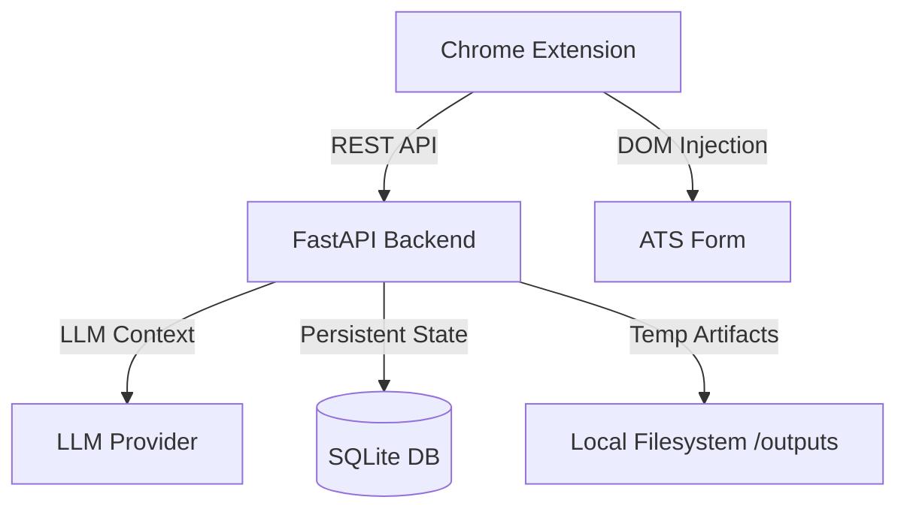

<div align="center">
  
  <h1>JobAgent</h1>
  <p><strong>The Neo-Brutalist AI Command Center for Job Searching</strong></p>
  <p><i>Automated Tracking • LLM Resume Tailoring • Form Sniping • Privacy-First Ephemeral Storage</i></p>
</div>

---

## 🚀 Overview

JobAgent is a high-performance, developer-first tool designed to automate the most tedious parts of the job application process. Unlike generic tools, JobAgent focuses on **high-quality tailoring** and **local privacy**, keeping your resume data and application history on your own machine.

### Core Modules
- **Scout**: Automatically captures job details from URLs and scores them against your profile.
- **Tailor**: Forges a custom LaTeX resume for every job, with a 2-pass "Shrink-to-Fit" logic.
- **Sniper**: Injects AI-powered answers directly into application forms (textareas/behavioral questions).
- **The Shredder**: Automatically cleans up temporary application artifacts after you apply to keep your system clean.

## 🏗️ Architecture



## 🛠️ Setup Guide

### 1. Backend (Python)
- **Requirements**: Python 3.10+, TeX Live (for LaTeX compilation).
- **Installation**:
  ```bash
  pip install -r requirements.txt
  ```
- **Execution**:
  ```bash
  python -m uvicorn backend.main:app --reload
  ```

### 2. Extension (Chrome)
- Open `chrome://extensions/`.
- Enable **Developer Mode**.
- Click **Load Unpacked** and select the `extension/` directory.

### 3. Profile Setup
Populate the `profile/` directory with your details:
- `personal_info.md`, `work_experience.md`, `skills.md`, etc.
- `resume.pdf` (Base resume for fallback).

## 🎮 Usage

### The Floating Action Menu (FAM)
Once installed, a green **AGENT** tab will appear on compatible job boards. Use it to:
1. **📥 Track & Score**: Grab the JD and get an LLM-powered match score.
2. **📄 Tailor Resume**: Generate a 1-page LaTeX PDF specifically for that JD.
3. **💉 Inject & Apply**: Download/Inject the tailored PDF into the ATS.
4. **🏁 Mark Applied**: Trigger "The Shredder" to clean up temp files and update your history.

### ✨ Sniper Answers
Look for the **Suggest Answer** button next to textareas on application forms. JobAgent will generate a tailored response based on your essay bank and the JD.

## 📑 Documentation
- [System Design & Philosophies](docs/DESIGN.md)
- [Project Workflow](workflow.md)

---
<div align="center">
  Built with ❤️ for the ambitious job seeker.
</div>
